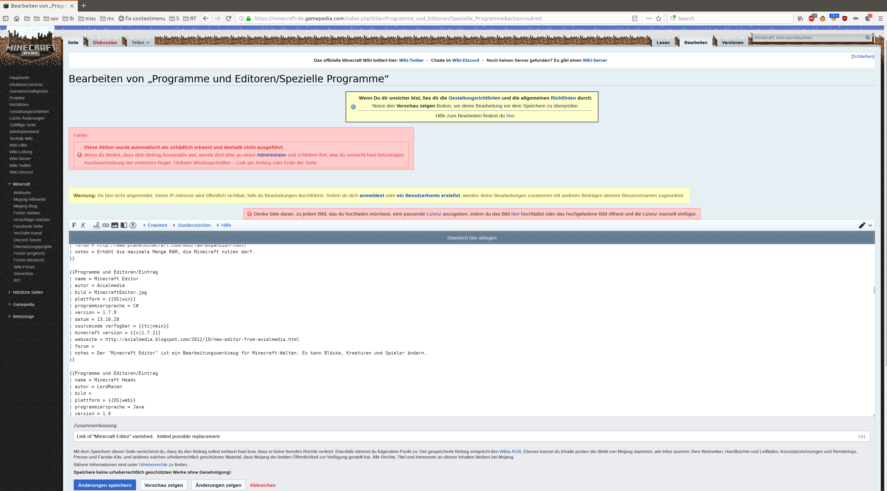

> Niemand darf mir diktieren, wie ich ihm helfe.
> Entweder, ihr akzeptiert die Hilfe, wie ich sie gebe, oder ich werde euch halt nicht helfen.
>
> So einfach ist das.
>
> Natürlich könnt ihr festlegen, wie ihr euch die Hilfe vorstellt.
> Aber vorher etwas ganz anderes zu behaupten um hinterher zu verkünden,
> dass das dann doch unerwünschte Hilfe war, sorry, so verhält sich ein aufrichtiger Mensch niemals!

# Hirnschiss Gamepedia

Ich weiß ja nicht, wieso, aber den Leuten da hat man offensichtlich ins Hirn geschissen.  Und zwar kräftig.

## Was los?

Naja, Gamepedia betreibt ein Wiki.  "wiki wiki" kommt bekanntlich aus Hawaianisch und heißt "schnell".

Außerdem schreibt Gamepedia ganz ausführlich, dass man ja in dem Wiki editieren darf.

In ihrer unendlichen Weisheit haben die Leute aber etwas gemacht, das irgendwie total kontraproduktiv ist.

Und das bezeichne ich nun einmal als Hirnschiss.

## Was war?

Naja, ich versuchte eine Seite zu editieren.
Genauer, ich versuchte einen gebrochenen Link auf einen Link zu ändern, den ich mit Hilfe von Google ermitteln konnte.
Es ist zwar nicht dieselbe Seite, aber eine Seite, auf der man den Download noch erreichen kann.

Und was passiert?  Das:

Naja, dann eben nicht.

## Zur Klarstellung

- Der [Link auf der Seite](https://minecraft-de.gamepedia.com/Minecraft_Wiki:Leitung), über den man sich an die Admins
wenden sollte, erklärt nicht, wie man sich an die Admins wenden kann.  
  Oh ja, ich habe mir die Mühe gemacht, herauszufinden, wie.  Und das Resultat ist mal wieder absolut destruktiv:
  - Der erste Link verkündete lapidar "[Fehler beim E-Mail-Versand](https://minecraft-de.gamepedia.com/Spezial:E-Mail_senden/Oliver_Scholz)"
  - Der zweite Link [geht auf eine Werbung für einen Domainverkauf](http://minecraft.de/member.php?28691-RockGermany)
  - Und der 3. Link will IRC.  Aus dem besten aller Gründen habe ich Chats vor etwa 15 Jahren bei mir endgültig verbannt.

- Der Name des Missbrauchsfilter "Link am Anfang oder Ende der Seite" wirft mehr Fragen auf als er Antwort gibt was eigentlich los ist.
  Hint:  Ich habe keinen Link eingefügt, weder am Anfang noch am Ende der Seite.  Ja, ich habe einen Link editiert.
  Wenn das schädlich ist hat irgendwer das Web offensichtlich nicht so ganz verstanden.
  **Hat da wer die letzten 30 Jahre Hypertext verpennt oder was?**

- Wenn sie keine Hilfe wollen, warum sagen sie das nicht klipp und klar vorher, bevor jemand sich die Mühe macht?  
  Das nicht zu tun ist böse!  [Zuerst die Leute anfixen](https://minecraft-de.gamepedia.com/Minecraft_Wiki:%C3%9Cber), und dann deren Hilfe ohne jeglichen validen Grund einfach ungesehen in den Lokus spülen!  
  Das nenne ich **mutwilliges antisoziales Verhalten**!  Wenn jeder so drauf wäre, na dann gute Nacht, Menschheit.

- Äh, wieso Login?  Es ist ein Wiki!  Bei Wikis gilt:  "Ein Login für ein Wiki ist wie Sex ohne Orgasmus"  
  (Die Umkehrung gilt ebenfalls:  Ein Wiki ohne Login ist wie Orgasmus ohne Sex)  
  Und wenn ihr denkt, man braucht einen Login, macht einen Reset und überdenkt es nochmals gründlich.  Tipp:  Es geht ganz ohne!
  Wer das nicht erkennen kann, ist IMHO einfach nur zu blöd für das Web.  
  Hint:  Seit über 20 Jahren betreibe ich ein Portal, das beweist, dass es vollkommen ohne Login geht.  
  Ganz ohne Cookies.  Ja, auch ohne Sessions.  Und es wird noch schlimmer.  
  Lesender-weise funktioniert das sogar gänzlich ohne JavaScript.  Oh ja, läuft wunderprächtig, seit über 20 Jahren!  
  Und **wenn ich das kann, dann kann das wirklich jeder**.  Man muss nur den Willen aufbringen, es richtig zu machen.  
  
Um es richtig zu machen, muss man nur den ganzen Müll loswerden, der einem seit ca. 20 Jahren in den Kopf geschissen wurde.

Natürlich bin ich mit meiner Forderung deutlich unfair!
Denn damals, als das Internet noch kein Mainstream war,
da lebten wir ja noch in einer gegenüber heute glücklichen Welt.
Keine Jahrzente voll von Fake-News und Indoktrination,
die uns im Internet von der Wahrheit ablenkten.

Da ich weder Prophet noch Genie bin, hatte ich, damals, überhaupt keine Möglichkeit,
all die heute allseits bestens bekannten üblichen prominenten Fehler auch nur zu erahnen,
die in den letzten 20 Jahren mit allerhöchstem Aufwand entwickelt und dann weltweit etabliert wurden.

Auch heute fällt es mir viel zu schwer, zu folgen, was allen Anderen ach-so-leicht fällt,
für mich ist es nämlich viel einfacher, all den Anderen ihre liebgewonnen Fehler vorzuhalten. 

> Und ja, ich bin zu faul, mich gegenüber den physikalischen Prinzipien zu emanzipieren.
> Deshalb sorry, dass ich stur immer nur meinen eigenen einfachsten Weg wähle.
> Und stur nicht und niemals auf andere zu hören, da bin ich ganz Mensch, wie jeder andere auch.

Wenigstens verstehe sehr gut, warum es nach über 20 Jahren Gehirnwäsche mit Hochdruckscheiße
jemand nicht schafft, all dem Mist im Hirn ledig zu werden.  Das benötigt übermenschliche Kräfte.

In sofern seid ihr in aller illustrester Gesellschaft.  Fühlt euch ruhig wohl da, aber ohne mich!
Ich kann - und will - euch gar nicht mehr helfen.

> Und das gilt für alle die es ähnlich Gamepedia machen.
> Don Quixote hat ja auch keine Chance gegen die allseits präsenten Windmühlenflügel.
> (Im Gegensatz zu Don aber bin ich Mathematiker.  Ich kann beweisen, dass mein Standpunkt korrekt ist.
> Dass der überwiegende Teil der Menschheit solche Mathematik aber niemals verstehen wird, das ist ja nicht mein Fehler.)
