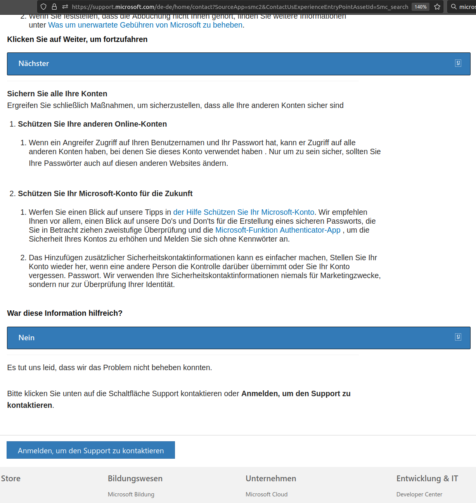
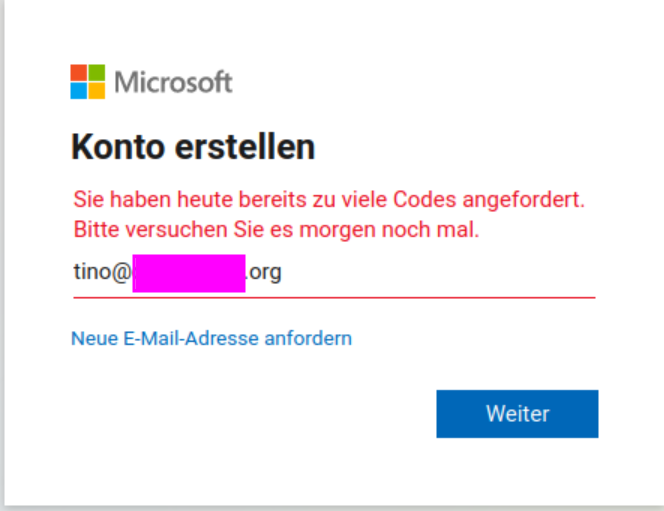

# Hirnschiss Microsoft

## Wann lernt es Microsoft bitte endlich

Ich versuche ein neues Konto für Onedrive eines Rechners einzurichten.
Dieser Rechner darf ausschließlich READONLY-Zugriff auf mein Onedrive bekommen.

**GEHT.NET**  Jedenfalls habe ich keine Möglichkeit gefunden, einen Rechner so einzurichten,
dass der am Microsoft-Konto teilnehmen aber nichts verändern kann.

Ich habe dann versucht den Support zu kontaktieren.
Um den Support zu kontaktieren muss ich mich anmelden.
Dies tue ich.  Es funktioniert auch alles.

Dann klicke ich wieder auf Support und bin nicht eingeloggt und muss mich anmelden.

Diese Probleme versuche ich Microsoft zu melden.  Dazu muss ich den Support kontaktieren.
Leider muss ich mich dazu anmelden.  **WAS JA IM SUPPORTPORTAL NICHT GEHT.**

> Ich vermute, Microsoft unterstützt hier Firefox nicht.
> Sprich, das funktioniert nur mit Edge oder so.

Egal, ich habe das dann aufgegeben.

Als ich dann versuchte, das Captcha zu lösen, kam bei mir irgendein Fehler hoch.
Ich vermute, dass die ein Non-Standard-Captcha verwenden und ich mal wieder halt kein
JavaScript an hatte.

Also habe ich den üblichen Tanz aufgeführt:

- Alles eingeben
- Durchklicken bis es nimmer weitergeht
- Nachgesehen, welche Scripte geladen bzw. nicht geladen werden weil der Firewall das bei mir blockt
- Dann das Script am Firewall zugelassen
- Reload

Und ich war wieder am Anfang.  Naja, ok, wieder durchlaufen.  Dabei muss man jedes Mal auf
neu seine Mailadresse bestätigen, als Mail aus dem SPAM-Ordner fischen und den Code eingeben.
Das habe ich auch brav immer gemacht, bis plötzlich:

Microsoft block mich, ich kann mir keine weitere Mail mehr schicken.

> Ich habe dann auf den nächsten Tag gewartet.  Aber um 2:00 Uhr morgens ging es noch nicht.
>
> Keine Ahnung was bei Microsoft "nächster Tag" ist, bei mir fägt der "nach Mitternacht" an.
> Wenn es 24h sind die man warten kann oder eine konkrete Zeit, warum schreiben die die nicht
> dazu?  Usability 6, setzen!

Ich kann ja verstehen, dass Microsoft die Leute nach N Versuchen (es waren vermutlich 5)
blockt.  Das geht soweit in Ordnung.

Nicht in Ordnung ist, dass der Anmeldeprozess derart komplex ist, dass man da Myriaden an
Scripten aktivieren und durchlassen muss, damit das funktioniert.  Eine einzige Domain
(oder eine zweite für das Captcha) sollten doch reichen, oder nicht?  Nope.

> OK, nicht ganz so schlimm wie sonst bei Microsoft, wenn ich 20 und mehr verschiedene
> URL-Quellen sehe, aber es waren doch so viele, dass ich eben nach 5 Iterationen
> noch nicht fertig war.

Soetwas nervt.  Und nein, ich würde ja keinen weiteren Microsoft-Account benötigen,
wenn Microsoft auch nur ansatzweise eine brauchbare Sicherheit konstruiert hätte.

Aber das ist nicht der Fall.  Hier ist, wo sie schrecklich schlampen:

- Alle Geräte im Account sind vertrauenswürdig.
  - In der Realität gibt es da Abstufungen.  Ein reines Surf-Tablet würde ich jetzt nicht
    gerade als vertrauenswürdig ansehen.  Das kann nämlich kompromittiert werden.
- Wenn man sich an einem Gerät anmeldet, braucht es das Kontopasswort
  - OK, sie gehen jetzt vom Passwort langsam weg und verwenden Security-Keys.
  - Nur doof, wenn das Gerät keinerlei sochen Input ermöglicht.
  - Das Passwort ist halt immer noch das Maß der Dinge
  - Warum das aber absoluter Mist ist, weiter unten
- Und dann, wenn man etwas Readonly teilt, kann man dies NICHT in OneDrive importieren
  - Sprich, ich kann nur Ordner, die Read/Write sind in OneDrive packen
  - Wenn so die Sicherheit in 2024 aussieht, na dann gute Nacht
  - (Schon mal was von Verschlüsselungstrojanern gehört?  Readonly verhindert Änderung.
    Aber Microsoft unterstützt uns da nicht, auf einfache Weise Sicherheit zu schaffen)

### Warum das mit dem Passwort Mist ist

Damit ist jetzt nicht gemeint, dass Passworte Mist sind und/oder abgeschafft werden müssen,
wie es inzwischen überall zelebriert wird (diese Abschaffung erzeugt jetzt ubiqitär
Bauchschmerzen, weil z.B. Office 2010 keine leeren Passworte unterstütz usw.
Komplett falsch verstandene IT-Grundlagen also).

Passworte sind dann Mist, wenn sie falsch eingesetzt werden.  Wie bei Microsoft und sonst wo.

Ein Passwort ist etwas, das ich weiß.  Damit das einigermaßen sicher ist, muss das kompliziert
sein.  Kompliziert bedeutet aber, dass ich das nicht ständig wiederkehrend eingeben will.

**Genau das machen sie falsch.  Alle.**

Und dann will ich das Passwort nicht dauernd überall eingeben müssen.  Das trainiert nämlich
falsch.  Passworte dürfen nur da eingegeben werden, wo sie sicher sind.  Das ist am besten
immer nur auf einer einzigen Webseite.  Und andere Webseiten dürfen das niemals anfordern.
Auch nicht für so Mist wie OAUTH oder sonstigen.

**Auch das machen sie falsch.  Alle.**

Richtig sieht anders aus.  Natürlich darf es mehrere Wege geben, wo ich das Passwort eingebe.
Aber die sollten sich dann auch im Passwort unterscheiden.  Also je nachdem, wo ich das
Passwort eingebe, ist es etwas anderes.  (Wer will kann sie ja alle gleich schalten.
Ich will das aber nicht.)

Und wie sieht dann ein Login auf einer fremden Seite aus?

Och, dafür gibt es viele Möglichkeiten, einige bequemer als die andere!  Nur keine wurde
so implementiert, jedenfalls nicht Service-Übergreifend.  Einige Services (wie Netflix
oder Amazon) kriegen es (manchmal, noch zu selten) für ihre eigenen Geräte hin.
Aber genau das fehlt eben auch übergreifend zwischen Services.

**Eine Möglichkeit mal hier skizziert:  Per zweitem Browser**

Wenn ich also Facebook mit Google verbinden will, gehe ich auf Facebook und klicke auf
"Mit Google verbinden".  Und dann darf ich mich aber NICHT bei Google einloggen müssen!

Entweder bin ich bei Google schon eingeloggt.  Dann KANN es sofort weitergehen.  Oder nicht.
Ob es so ist, das will ICH entscheiden, d. h. Facebook holt die Daten von Google,
Google aber blockt das erst ab und fragt mich.  Nicht in dem Fenster von Facebook.
Auf einem anderen Fenster, das ich ggf. erst öffnen muss.  Oder eben auf dem Handy per Popup.

So wird ein Schuh draus.  Und wenn ich NICHT eingeloggt bin, dann muss Google warten.
Und dann muss ich explizit Google öffen, mich da einloggen und dann erscheint,
in meinem Fall, dort ein Prompt dass ein anderes Fenster etwas will!  Für Leute, die es
bequemer haben wollen, geht es dann im anderen Fenster sofort weiter.

Übrigens geht das dann auch Browser-übergreifend!
Also ich Autorisiere Google mit Firefox, dass Facebook zugreifen darf,
Facebook selbst läuft aber in Chrome!
Und genau das ist die Killerapplikation:

Evtl. habe ich einen speziellen Browser, mit dem ich mich überall einlogge.  Der liegt
vielleicht auf einem verschlüsselten Laufwerk, damit man eben nicht da dran kommt.
Der Browser wird auch automatisch beendet, wenn ich den Platz verlasse (weil ich das
Handy mitnehme und es die Bluetooth-Verbindung zum Computer verliert).

Oder ich packe die Autorisierung auf ein eigenes Device.  Da muss ich nichts zu tun.

Facebook will von Google die Daten, ich logge mich auf dem Autorisierungsdevice ein und
gebe es dort frei!  So muss das einfach aussehen.

**Eine weitere Möglichkeit mal hier skizziert:  Einmalpassworte**

Ich will also, dass Facebook auf meinen Google-Account zugreifen kann.

Dann erzeuge ich ein Einmalpasswort bei Google, in dem alle Richtlinien gesetzt sind,
und das paste ich bei Facebook.  Eigentlich sehr sehr einfach.

Wenn Facebook es mir leichter machen will, dann fordert es das bei Google an.
Dann gehe ich zu Google, das informiert mich, dass da eine Anforderung von
Facebook da ist, und ich kann draufklicken und komme zu dem Einmalpasswort.
Das kann ich dann sehen und ggf. korrigieren was Facebook sieht und dann dort abschicken.

Die Übertraung geschieht dann hinter den Kulissen, fast wie bei der anderen Möglichkeit.
Der Vorteil aber wäre, das funktioniert auch mit Altdevices die zwingen dein Passwort
benötigen, denn da ist ja immer noch eines!

Tatsächlich sollte das nur einmal funktionieren und nur kurze Zeit gelten.
Sprich, ein Tool kann damit eine Session anfordern und alles ist gut.

Wenn es richtig gemacht ist, kann ich das auch protokollieren, dann sehe ich genau,
in einem eigenen Protokoll, also ganz unabhängig von Google oder Facebook,
welches Passwort wann oder wie angefordert wurde.

Der Vorteil gegenüber der vorherigen Sache ist, dass ich diese Einmalpassworte
vorab, also in der anderen Richtung generieren kann.  Also wenn ich möchte,
dass Facebook auf Google zugreifen darf, generiere ich mir ZUERST eines bei Google,
und paste das dann bei Facebook rein.  Facebook verwendet es dann, um sich zu
autorisieren und alles ist gut.

Flexibilität!

> Überhaupt:  Facebook legt fest, was es bei Google sehen darf?
> WTF geht's noch?  Selbstverständlich bin ich der Herr über meine Daten!
> Wenn Facebook meint, zig Daten abrufen zu müssen, dann muss es möglich sein,
> diese so hinzufaken wie man will.
>
> Facebook kann ja im Fall des Falls einen Anwalt einschalten und die Realdaten
> von Google erfragen!  Falls der Richter das genehmigt.
>
> Nur so geht Datenschutz!
>
> Ach ja, Google soll sich da mal nicht zieren.  Faken ist in Ordnung.
> Selbst unser ePerso soll (ich hab's bisher nicht testen können mangels Möglichkeit)
> ja auch Pseudonyme unterstützen.  Ganz von staatlicher Seite.
> Wieso soll das dann bein einem Privatunternehmen nicht gehen?

Nur so geht Sicherheit.  Und was sie jetzt tun aber ist eigentlich dasselbe, nur mit einem
Geschmäckle, nämlich dem Vendor-Lockin.  Wenn ich da irgendwelche proprietären
Security-Keys oder andere seltsame Verfahren brauche (wie den Microsoft Authentikator)
dann werde ich davon abhängig.  **Das ist vermutlich gewollt!**

Dabei ginge es ganz anders:

Einfach eine offene einfach gestaltete API die jeder versteht
und dann kann man einfach Verwenden was man will.  Meine Idee ist z.B. eine RFID-Box,
die man sich selbst basteln kann und die einem die Authentikation abnimmt.  Etwas, das
sehr speziell meins ist.  Nichts was man im Laden kaufen kann.

Diese Kästchen, das auch meine Biometrie überprüft, muss dazu einfach nur ans Handy gehalten
werden.  Den Rest macht das Kästchen.  Klingt kompliziert, ist es aber wirklich nicht.
Denn ich habe inzwischen 3-4 elektronische Schlüssel an meinem Schlüsselbund.
Weg mit denen und einfach durch das Kästchen ersetzt.

Wenn mir jemand das Kästchen klaut geht es nicht, weil es ja nur bei mir funktioniert.
Wenn mich jemand zwingen will, das Kästchen zu verwenden, OOPS ich bin draufgetreten.
Auch dann ist alles sicher.

Da ich aber meine Logins selbstgestalten kann, weil ich von niemandem Abhängig bin,
kann ich dann, wenn alles wieder gut ist, in den Garten gehen, das Ersatzkästchen
ausgraben und aktivieren (mit einer Sequenz die nur mir bekannt ist).

Alles supereinfach umzusetzen und vor allem eines:  Billig!

So ein PI Zero, der das kann, kostet keine 10 EUR.  Vergleicht das mal mit den ganzen
FIDO2-Keys.  Da gibt es keinen unter 30 EUR.  Ganz schön viel Holz.

Tatsächlich braucht es nur ein RFID-fägiges Prozessörchen.  So etwas dürfte für 1 EUR
mit Gewinn herzustellen sein.  Aber nö.  Soetwas darf sich angesichts der Monopolisierung
der Authentikation selbstredend nicht entwickeln, das wäre ja .. Freiheit!

TL;DR:

Bleibt halt nur der fade Nachgeschmack, dass ein derart umständlicher Umgang mit Accounts bei
Microsoft einfach nur absoluter Bullshit ist und nicht mehr zeitgemäß.

Irgendwer sollte den ganzen Mist mal ordentlich überarbeiten, damit man eben nicht gezwungen
ist, für jede Kleinigkeit einen weiteren komplett frischen Account zu basteln und sich zu
merken.  Kein Wunder dass die Digitalisierung so nicht voran kommt.

Merke:  Jedes Gerät muss seine eigene Policy haben.  Derzeit geht das nur, indem man
jedem Gerät einen eigenen Account zuweist und diese dann irgendwie anders koppelt.

Für mich alles kein Problem, ich habe inzwischen hunderte Accounts.  Aber für Normalbürger.

> Kleiner Witz am Rande:  Ein Raspberry PI Zero kostet keine 10 EUR.
> Aber jeder soll ja seine eigene Identität haben.
>
> Ich habe bald 40 Stück davon.  Jeder bekommt seinen eigenen Account.
> Wo, das habe ich noch nicht ganz raus.  Google oder Microsoft oder was weiß ich.
>
> Microsoft bietet weniger Platz (5 GB ist nicht viel, angesichts dass ich inzwischen
> Probleme habe, vernünftige Speicherkarten unterhalb von 64 GB zu finden),
> hat aber den besseren Authentikator.
>
> Google ist hingegen - wenn man Android verwendet - bequemer und bietet auch mehr Platz.
> Und warum eigentlich nicht beides?  Also Google und Microsoft parallel ..
