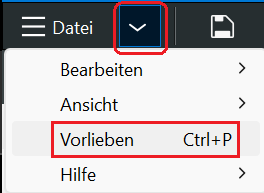
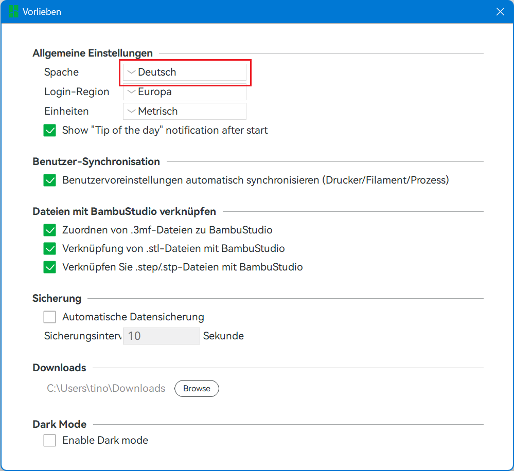
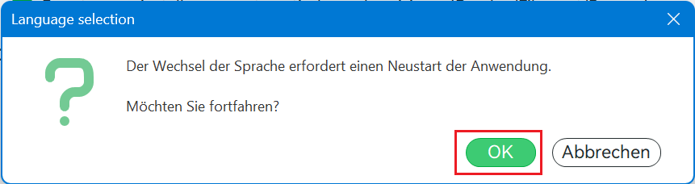

# BambuLab X1 Carbon Combo WTFAQ

## Der X1 ist nur etwas für englischsprachige Nutzer die die Dokumentation lesen und deren Fehler mit Köpfchen umschiffen

Derzeit (Januar 2023) halte ich es für absolut unmöglich, den 3D-Drucker BambuLab X1 zu betreiben, wenn man Englisch nicht gut versteht.

Außerdem ist es nicht für Leute geeignet, die:

- rein nach Dokumentation vorgehen wollen ohne dabei auch das eigene Hirn zu verwenden
- oder die grundsätzlich keine Dokmumentation lesen und alles intuitiv machen wollen

Der Drucker ist deshalb nur für Leute zu empfehlen, die ausreichend Zeit mitbringen, um jeden Schritt zu verstehen, bevor sie ihn umsetzen.

Ansonsten werden sie etwas kaputtmachen.  Garantiert!

> Vielleicht kommt jemand damit klar, der im 3D-Druckbereich extrem erfahren ist.
> Ich bin das nicht und aus dieser Warte betrachte ich es logischerweise.

Die Dokumentation in Englisch ist in einem mehr als nur desolaten Zustand.

- Viele mögliche (aus meiner Sicht sogar die meisten) Fragen werden nicht oder teils sogar falsch beantwortet.
- Ohne eine ausführliche Recherche im Internet sind einige Schritte nicht zu bewältigen
- Wichtige Details sind, wenn sie überhaupt beschrieben sind, so unscheinbar erwähnt, dass man sie gerne übersieht.

usw.

Ich versuche zwar hier, alles wichtige - für mich, nicht für andere - zusammemzutragen,
aber kann leider auch nich versprechen, dass meine Angaben

- komplett
- vollständig korrekt
- leicht verständlich
- auf Deutsch

sind.  Das meiste, was ich hier reintippe ist aus dem Gedächtnis.

Da der BambuLab aus meiner Sicht nur in Englisch betrieben werden kann,
bedeutet das, dass ich mich immer nur auf die Englische Benutzerführung usw. beziehe
und alle anderen Seiten auf Englisch halte.

Sofern es sich nur auf "Deutsch" bezieht, befindet es sich auf dieser Seite.

## WTFAQ

### Bambu Studio auf Englisch umstellen

Ich hatte den Fehler begangen, Bambu Studio auf Deutsch einzurichten.  Auf Englisch schaltet man wie folgt um:

Per Tastatur:

- Strg+P
- Unter "Allgmeine Einstellungen" Sprache auf "English" umstellen
- Es erscheint ein Popup
  - Per "Return" das "OK" anwählen

Per Maus:

- Links oben: Rechts neben "Datei" auf den Pfeil nach unten klicken
- "Vorlieben" anwählen
- Unter "Allgmeine Einstellungen" Sprache auf "English" umstellen
- Es erscheint ein Popup
  - Auf OK klicken

Im Bild:

