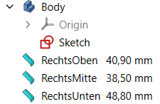

> FreeCad 0.20.2

# FreeCad HowTo

## Measurements done right

You are in Sketcher and want to measure the distance between two points.

-----------------

What following does:

- It attaches the two points of a measurement onto some point on the sketch
  - So if the point changes it's position, the measurement becomes updated, too
- It places the measurement in the description of the Measurement
  - This way you can see it in ComboView
  - This way you can see the value of the Measurement from Sketcher, too
- You do not have to worry about if you have positioned the Measurement correctly

-----------------

Step 1: Add some random measurement

- Adding measurements does only work outside of Sketcher
  - for unknown reason "Measure Distance" is greyed out in Sketcher
  - press `ESC` two times to leave Sketcher
- Then you see your object / shape
- Click on the "Measure Distance" tool (AKA `Std_MeasureDistance`)
  - Click anywhere in the object
  - Click a second time anywhere else in the object
  - Both klicks must hit some object, else it does not work
  - We will correctly position the both points later!

Step 2: Fix it to display the real calculated measurement in ComboView

- Now a new measurement shows up
  - Rename it (the Label) to what you want to name it.
  - The default name (the distance string) is misleading, as it is static regardless how big the distance is
  - If you use `f(x)` for the Label, you will be doomed afterwards!
- Now click on the Description field
  - Be sure you are in the Description and not the Label!
  - Click on `f(x)`
  - Enter `.Distance.UserString`
  - Click OK

Step 3: Set the points where they belong

- Click on the first point where you want your measurement to start
  - In "Python console" (if shown) you will see something like `# Gui.Selection.addSelection('Project','Body','Sketch.Vertex1',0,0,0)`
  - In "Selection View" (if shown) you will see something like `Project#Body.Sketch.Vertex1`
  - What you need here is `Sketch` and `Vertex1`.  Remember that.
- In ComboView click on the Measurement you want to set the point for calculation
  - Below in the Properties under "Measurement" click in the "Value" field of the point (`P1` or `P2`) you want to set
- Click the `f(x)` button
  - Enter `Sketch.Shape.Vertex1.Point`
  - `Sketch` is the remembered name
  - `Vertex1` is the remembered vertex
  - `.Shape.` and `.Point` must be literally added
- Repeat for the second point

Notes:

- If you click on some object in "Selection View", you will see something like  
  `Gui.Selection.setPreselection(App.getDocument('Project').getObject('Body'),'Sketch.Vertex1',tp=2)`  
- This means you can use `x=App.getDocument('Project').getObject('Body').getObject('Sketch').getSubObject('Vertex1')` in Python Console to put the object into variable `x`
- Then you can type `x.` in the Python Console to see some popup with all the possible properties and dig deeper into the object

Missing links:

- I did not find out how to name a Vertex with some meaningful name, so you can better recognize it later on
  - I did not find out how to relate to this meaningful name, so it becomes easier to reference a Vertex
  - I do not know what happens, if you copy and paste into another project.  
    Probably all the references become incorrect, because there is no meaningful name
- This should be extended to other things than vertices.
- However this guide here is for Sketcher
  - Such that you can see the measurement in Sketcher because it is updated in ComboView
  - And in Sketcher you usually want to set a point where you want to measure.
