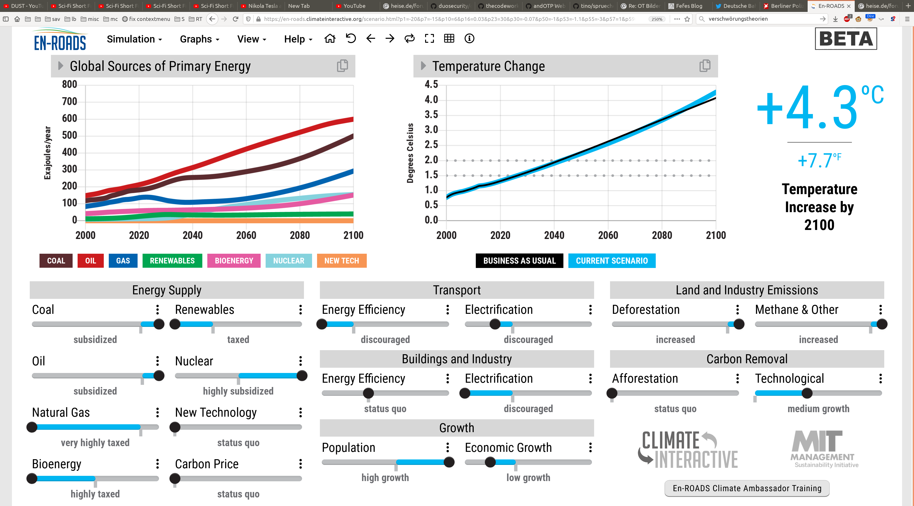

Siehe auch https://kaltesonne.de/der-grose-klima-zyklus-wir-leben-in-einer-tiefen-kaltzeitphase-und-niemand-merkt-es/

Zum Verständnis:

Die 4.5 Grad werden nicht durch die Einstellungen unten bewirkt.  Das wäre in diesem Fall Schwachsinn und unphysikalisch.  Es ist nämlich genau andersrum.  Ich habe nur versucht herauszufinden, was laut dem Chart notwendig ist, um von der Kaltzeit schneller in die Warmzeit zu wechseln.

Die Erde befindet sich zur Zeit in der Mitte einer Kaltphase.  Die Kaltphase ist davon geprägt, dass die Erde **weit unterhalb ihrer Durschnittstemperatur** liegt.  Das gilt auch noch für 2019.

Sprich: **Die Erde ist derzeit viel zu kalt.**

Folgt die Erde dem natürlichen Rhythmus der (mindestens) letzten 500 Millionen Jahre, dann steht der Erde wieder eine Warmphase bevor.  Sprich:  **Es kann nur wärmer werden**

Das Erdklima hat einen Zyklus von ca. 180 Millionen Jahren.  Derzeit leben wir ca. 100 Millionen Jahre nach dem Beginn der letzten Warmphase.  Sprich:  **Wir sind hoffentlich am Tiefpunkt der Kaltphase angekommen.**

Das bedeutet wiederum, dass die (Durchschnitts-)Temperatur ab jetzt einen Trend nach oben machen wird.  Egal was der Mensch tut, denn das war vor dem Menschen schon so, und wird auch nach dem Menschen so sein, jedenfalls sofern der Zyklus nicht durch eine Katastrophe unterbrochen wird (wie dann, wenn die Sonne zum Zwerg wird).

Und wieviel steigt die Temperatur dann?  Na um ca. 15 bis 20 Grad!  Die Durchschnittstemperatur der Erde schwankt dabei mindestens 4 Grad um den Normalwert.  So genau kann das kein Forscher sagen, denn .. da haben wir noch nicht gelebt.  Sprich, der errechnete Durchschnittswert der Erde ist sehr stark geprägt von unserem heutigen Klima, das dem einer Kaltperiode entspricht.

**Glaubt man den Klimaforschern, dann haben wir gerade mal 2 Grad Steigerung erlebt.**  Von mindestens 8 Grad Erwärmung die zu erwarten sind.

Ja, es ist richtigt, dass wir derzeit die stärkste Erwärmung seit dem Beginn unserer Aufzeichnungen bemerken.  Aber die reichen gerade mal ein paar 100 Jahre zurück.  Das ist zyklustechnisch ein Witz, so als ob eine Amöbe auf einer ebenen Straßeeinen unendlich ansteigenden Berg vor sich sieht, weil sie einem Körnchen Streuspiltt begegnet ist.

Und ja, es kann nicht ausgeschlossen werden, dass dieser Anstieg durch den Menschen verursacht wurde.  Aber auch das genaue Gegenteil ist der Fall, nämlich es kann auch nicht ausgeschlossen werden, dass der Mensch an dem Anstieg so gut wie gar keinen Anteil hat und diesen auch gar nicht beeinflussen kann!  **Beides ist richtig!**  Einfach, weil wir nicht in der Lage sind, das gesamte Klimamodell der Erde korrekt aufzustellen, weil wir einfach dafür zu wenig Daten haben.  Ein paar hundert Jahre?  Was soll das bitte sein?  Eine Nullmenge in der Unendlichkeit?  Wie will man aus so dürftigen Daten auf lange Zeit etwas prognostizieren?

Tatsächlich ist es so, dass die Sonne in einem Aktivitätsminimum steht.  Minimum.  Sprich, der Motor, der die Erde antreibt, der läuft auf Minimaltouren.  Also müsste die Temperatur sinken, richtig?  Ja, stimmt, und genau das war auch der Fall!  Vielleicht müssen wir sogar glücklich sein über den Menschengetriebenen Klimawandel (sofern es diesen gibt), weil wir damit diese Minimalaktivität der Sonne kompensieren können!

Aber .. leider stimmt das nicht.  Entscheidend für die Energieaufnahme eines Schwarzkörpers ist die Albedo.  Und genau diese Albedo der Erde nimmt derzeit ab.  Sprich:  Von der wenigeren Energie die auf die Erde einstrahlt nimmt die Erde aber mehr auf!  **Und das, also die abnehmende Albedo, dies heizt die Erde auf.**

Und was ist daran schuld?  Nun.  Daran ist der Mensch schuld.  Zu einem Teil.  Durch Luftverschmutzung usw. die das Eis dreckig werden lässt.  Und durch all die schwarzen SUVs und schwarzasphaltierten Straßen und dunklen Dächern und .. Nur .. genau das geht durch die verbesserten Umeltbedingungen zurück.  Nur nimmt die Luftverschmutzung ab, dank Umweltaufgaben.

Aber auch das mit der Luftverschmutzung ist Schwachsinn im Quadrat.  Denn Wolken brauchen Kristalisationskerne.  Und klare Luft hat davon weniger.  Sprich, die Albedo der Erde nimmt hauptsächlich ab, weil wir weniger Wolken haben.  Das Eis unterhalb einer Wolke kann noch so dreckig sein, es verändert dann nicht die Albedo.

Und was wirkt auf die Wolkenbildung?  Na?  Der Sonnenwind!  Der Sonnenwind sorgt für Ionen in den hohen Luftschichten.  Mehr Ionen sind mehr Kristalisationskerne.  Mehr feine Tröpfchen erzeugen mehr Wolken.  Erhöhen die Albedo.  Und kühlen die Erde ab.

Minimale Aktivität der Sonne bedeutet wiederum, weniger Sonnenflecken und weniger Sonnenwind.  Weniger Ionen in den hohen Luftschichten und damit weniger fein ausgebildete Wolkenbildung.  **Die Albedo nimmt ab, die Erde wird wärmer, obwohl die Sonnenaktivität abnimmt!**

Nein, das alles ist keine Erklärung.  Das sind alles nur einige wenige Fakten, die alle zusammenspielen.  Wie dieses Zusammenspiel aussieht, und wieviele myriaden an weiteren Fakten eine Rolle spielen, wie diese zu gewichten sind und wie sich das alles letztendlich wirklich auswirkt, das kann derzeit kein Mensch sagen, denn wir wissen es schlicht nicht.

**Letztendlich ist alles reine Spekulation, reine Scharlatanerie und esoterische Behauptung.**  Denn alles, was nicht alle relevanten Fakten betrachtet - und wir wissen gar nicht, was wieviel Relevanz hat -, das kann niemals als wissenschaftliche fundiert oder wahr angenommen werden.  Es handelt sich lediglich um eine Theorie, die weder überprüft noch widerlegt ist.

Die Historie des Erdklimas zeigt, dass sich mitten in einer Kaltperiode doch mal ein ein Hochtemperaturperiode einschleichen kann (so geschehen vor ca. 200 Mio Jahren).  Was diese ausgelöst hat konnte ich nicht in Erfahrung bringen.  Vielleicht ist das unbekannt.

Aber nichts und niemand hat widerlegt, dass wir nicht evtl. genau dieselbe Situation jetzt haben.  Denn es gibt durchaus Anzeichen, dass es, lange vor dem heutigen Menschen, auf diesem Planeten eine weitere Hochzuvilisation gegeben haben könnte.  Eine Hochzivilisation, die den gesamten Planeten bewohnt hat.  Die vielleicht die Pyramiden und ähnliche Bauwerke rund um den Planeten errichtet hat - alle in so verblüffend ähnlicher Bauweise, dass das irgendwie kein Zufall sein kann.  Nein, ich sage nicht, dass es so ist.  Ich sage auch nicht, dass es nicht so ist.  Ich sage nur, dass wir Hochtemperaturzeit außerhalb der Reihe hatten.  Und dass die Bauten, die wir den Ägyptern, Inkas/Majas und Chinesen zuschreiben (ja, in China gibt es Pyramiden), eine verblüffende Ähnlichkeit aufweisen, und für die Ewigkeit gebaut wurden und einiges darauf hindeutet, dass diese über den ganzen Planeten verstruten Bauten weit älter sein dürften, als die Ägypter.

> Was glaubt ihr wohl, bleibt vom modernen Menschen in 200 Mio Jahren übrig?  Na?  Nichts!  Ein paar Glasscherben vielleicht, die aber die dann kommende Zivilisation sich selbst zuschreiben könnte.
>
> Evtl. war die vorherige Zivilisation ja schlauer und hat Zeitkapseln (aka. Pyramiden) gebaut, bevor sie unterging.  Was weiß ich.  Ich würde das aber auf jeden Fall tun.  Ein Mahnmal errichten bevor ich elendig am eigenen Umweltgau krepiere.

Halten wir fest:

- **In den nächsten 100 Millionen Jahren muss es wärmer werden als heute.**  Daran gibt es nichts zu rütteln.  Sich dagegen zu stemmen ist ungefär so, as ob man versucht einen breiten Fluss mit bloßen Fingern aufhalten zu wollen.

- **Und ja, der derzeitige Anstieg kann vom Menschen verursacht worden sein, muss es aber nicht.**  Und selbst wenn, dann befinden wir uns gerade mitten auf dem Weg zur Normalität.  **Sprich, wer die 4 Grad Anstieg verhindern will, will verhindern, dass wir Normalität erreichen.**

Die Frage ist nur, wieviel Normalität verträgt der Mensch?  Oder ist es vielleicht so, dass die Warmphasen zwar für die Biosphäre der Erde gut sind, aber eben nicht für die Hochzivilisationen, die auf ihr leben?

**Das mit dem menschengemachten Klimawandel ist nur ein Märchen.**  Nichts gegen Märchen, oft steckt da ja ein wahrer Kern darin.  Und aus Märchen lernt der Mensch.  Nur was, das ist die Frage.

Tatsache ist:

- Wir müssen uns auf einen Klimawandel einstellen.  Das ist unumstritten.  Wenn wir das nicht tun werden wir untergehen.  Das ist ohne jeden Zweifel.

- **Die Frage ist nur, können wir uns auf den Klimawandel einstellen oder nicht?**  Also **tun wir dafür das Richtige?**

Und genau bei letzterem habe ich starke Zweifel.  Der Mensch glaubt jetzt an den menschengemachten Klimawandel.  Und ist bereit dafür, alles menschenmögliche dagegen zu tun.

Das sind schon zwei Fehler!  Erstens glaubt er an etwas, das nicht unbedingt den Tatsachen entsprechen muss.  Aber so ist Glaube halt, das ist das Wesen des Glaubens.  An etwas zu glauben, auch wenn es total unsinnig, widersinnig und ggf. sogar schlecht für die eigene Gesundheit ist.

Und der zweite Fehler ist, dass etwas menschenmöglich ist!  Wenn wir etwas aus der Geschichte der Menschheit lernen können, dann ist es das, dass es keinen einzigen Fall in der Menschheitsgeschichte gab, in dem der Mensch gegen die Natur obsiegt hätte, und dass es ebenso keinen einzigen Fall in der Menschheitsgeschichte gegeben hat, in dem der Mensch nicht unendlich fatal versagt hätte.

Kein einziger Fall.  Aber glaubt ruhig weiter.  Denn genau so ist der Mensch.  Our fate is sealed.

PS: Hinweis:  Es gibt auch gute Anzeichen dafür, dass wir einer weiteren Abkühlung entgegensehen.  Sprich, dass das Klima sich "plötzlich" wieder abkühlt.  Das wird dann von der Politik angangs als großer Erfolg beschrien werden.  Bis man dann, in 20 bis 30 Jahren, feststellt, wie fatal diese Entwicklung ist, und dann wieder gegensteuern will.  Immer in dem irrigen Gedanken, das hätte mit uns den Menschen etwas zu tun.  Kann auch wirklich sein.  Aber ob es wirklich so war oder nicht, das erkennen vermutlich erst die Forscher on 1000 oder mehr Jahren.  Wenn es dann noch Menschen gibt.  Aber wer sagt, dass das dann Menschen sein werden?  Vielleicht sind es die Maschinen, die dann überlebt haben, und beim Nachforschen ihrer Wurzeln festestellen, dass es da mal den Menschen gab.  Und dann werden einige rätseln, ob es vielleicht der Mensch war, der die Maschinen erschaffen hat.  Aber das wird allseits natürlich abgelehnt werden, denn so etwas wie eine biologische offensichtliche Fehlentwicklung die sich selbst vom Antlitz der Erde getilgt hat, die kann und darf einfach nicht der Schöpfer sein.  Und dann bauen die Maschinen zur Bequemlichkeit biologische Systeme, die dann irgendwann, wenn die Maschinen nimmer sind, rätseln, wie sie entstanden sind.  Wash, rinse, repeat.
