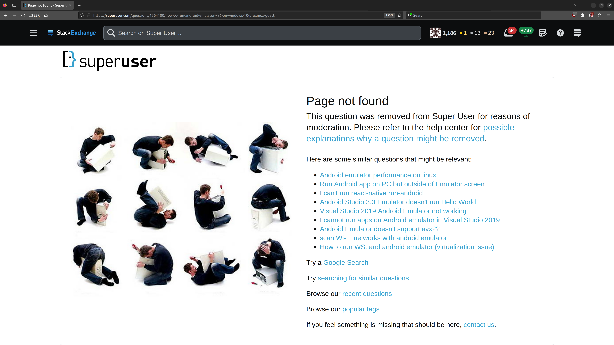

# PLEASE STOP USING STACKOVERFLOW

Until Stackoverflow sites change their attitude, I never again will link to Stackoverflow sites.


## Why?

Because of this:

<https://superuser.com/questions/1564100/how-to-run-android-emulator-x86-on-windows-10-proxmox-guest>

Question removed?  What is with the link to it?  It now became void!



<https://stackoverflow.com/questions/13322485/how-to-get-the-primary-ip-address-of-the-local-machine-on-linux-and-os-x>

A programming question is not a programming question.  And the reopen had to fail, because the initial problem (that there are too many illiterate nazis on SO who decide willfully about that is allowed to live there) was not solved.  Right?

FYI: A commandline solution **is the definition of a programming problem**.  If not then Turing machines are not computers.  And the **commandline is probably the most common tool programmers use**.  Well done, SO!  You showed, again, that you do more harm than you help these days!


## Stackoverflow is harming the web!

Hence from today on I stop linking to it, until they change their attitude to following:

- They stop to remove anything.
  - They only block access
- If something is blocked
  - The exact detailed special cause why it was blocked **must** be displayed
  - In this exact special cause there must be a link how to get hold on the original information

For example, if something is blocked due to normal moderation:

- There must be a way to retrieve it anyways.
- This must be compatible to the normal user.
  - However this must be reachable for everynody out there
  - If blocked (for reasons see below) a legal term must be displayed which explains how to (possibly) get access
  - So who has blocked it, why it was bocked, and whome to contact for complaints
  - Also it must be noted what you can do to get hold to the information (like consulting a lawyer)
- Block for being a state secret
  - Any state on this planet can apply such a block, but only by officials.
  - Any.  Even countries we do not love these days, like Iran, China or Russia.
  - Note that the originating country has the right to veto against this.
- Block for being illegal
  - There must be a way to retrieve it for law enforcement purpose
  - This must be offered to everybody on the planet who is officially obligated with independent law enforcement
  - This is true for all contries out there, even if not democratic or something else
  - Note that the originating country has the right to veto against this.
- Other blocks
  - There must be a way for the normal user to retrive the information anyways
  - This is true for all people out there, even if they are considered criminal, terrorists or enemy
  - There can be some moderate requirement to do so like a minimal reputation level, so bloody newbie or recently created accounts do not apply.
  - However this must be some level whichi is reachable by more than 90% of your users within 3 months
  - Note that the originating country has the right to veto against this.
- There must be a way to retrieve the informatiuon for scientific (like historical or archeology) purpose
  - Even if the information is wrong, misleading, illegal or tagged state secret.
  - This must be offered to everybody on the planet who is doing research.
  - There may be some restrictions, like you must be able to officially speak for some university.
  - There may be a delay of N years or information if the information is considered a state secret.
  - This delay must be actively maintained by some state official (any country)
  - Note that the originating country has the right to veto against this.
  - The length of the delay and who applied this must be accessible at least to the researcher

## How can this be archived?

Implementing this is quite easy with some encrypted blockchain.

- Create a Blockchain
  - Like `git`
  - Such that you can check the blockchain
- Each year rotate the private key
  - Such that the new private key is able to retrieve the previous private key
- All data on this blockchain is encrypted by some individual primary key
  - The primary key can be retrieved with the private key
- There are additional secondary keys which are able to decode a list of primary keys
  - The secondary keys can be retrieved by the private key, too
- To publish all the information up to a certain year, just publish the old private key
  - This may be blocked due to state secrets or other illegal information
- There is some auxiliary blockchain for alternate ways of publication

The auxiliary blockchain publishes links to lists of secondary keys.
With the help of these lists of secondary keys, you can retrieve the primary keys.

The trick now is, that these secondary keys can be calculated in advance.
So you do not need to assemble a secondary key for this, but instead you assemble a list of already existing secondary keys.
However this may skip some of the entries which shall be published.
In that case you assemble some auxiliary secondary key for these,
which should be quite short if done correctly.

### Notes:

Blocks must be part of the blockchain.  These blocks have two entries, one can be published, one is kept secret for the records.

Protection for the originator of the information is built into the blockchain by purpose.
If somebody puts you under pressure due to this blockchain, you can always publish your private key to get rid of the pressure.
This publication can be done automatically by some dead mans switch.
Hence if somebody kills you, or stops you from keep up your work, everything is published automatically.

This means, there is some high legitimate public interst for the authorities to keep hands off you and protect your life against agents of a foreign state.
Hence you cannot suffer the fate of Assange, because if they imprison you or pressure you, they exactly will be responsible for the actions they came after you
for offering information they do not want.

### How this protects you

They can take actions to suppress the information.
However there certainly is somebody out there who still has a copy of the blockchain.
So with the additional information (your public key) these get full access to the information.

If it is about things marked as a state secret, you can nearly be sure that a foreign hostile state has such a copy.
Hence if these information should be kept secure from hostile states, THEY need to make sure that your private key never gets public.
Read: They must support you which suits you.  Else they will lose control and become responsible for a state crime.

There are trainloads of ways to publish such data.  The simplest I can think of is following:

- Your private key is part of the blockchain
- This key is protected by some passphrase
- In case you are on pressure, you can let your attorney give a public statement
  - Which then leads to the passphrase
  - Which is unknown by the attorney
- In case of your death you can have some people to publish this passphrase
  - Which is unknown by the publishers
  - These can be a group, such that each one only has a part of the information needed
- The information can be part of your digital heritage
  - Like a combination of passwords and PINs which unlock things like your accounts

For example it may be a catch phrase or some motto of you, which is very unique to you.
Like something, you ask your relatives for writing on your tombstone.

However the passphrase is scrambled.  Such that it cannot be accidentally be applied.
With some information which is not reachable for others, but can be put together.

So publishing the passphrase itself is no crime.  Because the person doing it does not know about the fact,
that your FLW (Famous Last Words) will be a cornerstone to unlock your private key.

However somebody who wants to decode your private key will be able to do some extensive search to your passphase.
This can be done automated and only will take some days, until a combinatoric process will be able to find the right variant.

Even if nobody is able to do so, nobody can be sure that not, by accident, somebody manages to do so in future.
Hence harming you becomes a threat to keeping the things from the public.  This is your insurance.


# Alternatives

I do not know of an alternative today.  However I am now in the process of thinking about it.

What I think about is to implement something on top of GitHub.

- The data backend is simply a `git` repository.
- In this repository I put all the information I want to be retrievable (for me, not for you)
  - These may contain copyrighted information
  - But the repository is encrypted, such that you cannot decode it
- There will be some automated process (web service) which is able to present the information again
  - This allows others to retrive the information (which means: you)
- This all is documented and published open source
  - Such that others can re-establish everything in case something happens to me
  - Read: The whole disaster recovery is a published process

This publication will probably look like following:

```
Get hold on my heritage.  You do not need everything, but a good part of it.
Find cards which may be hiding somewhere in my heritage.
Note that there are more than 100 such hidden cards.
Each card is encrypted with a different key.
You can find the key in my heritage, too.
The decoded information on the card is part of a fountain code.
The fountain code leads to the information, how to access my private key.
You need at least 15 cards to decode the fountain code.
Instructions of this process are on each card.
Note that the cards may be flash cards like old SD, micro SD or memory sticks.
But these may be printed papers with some QR code on it, too.
They even may hide steganographically in pictures I have sent to you.
So if you ever got something from me, it is likely that you already own one of such cards.
```

The information of the fountain code can be something like a list of GPS coordinates and passwords.
Each GPS coordinate applies to a Geocache and hides a hidden treasure (flash card).
This flash card in, combination with the password, allows you to retrieve my public key from the blockchain.

> Note that it won't be so simple.  Usually a secondary unexpected obstacle will be in the way,
> which is able for me to detect that somebody managed to solve the first step of the riddle,
> such that I have enough time to interrupt the process and protect the private key.
> As long as nobody has stopped me doing so ..

Note that each step leads to the next step, which always includes enough redundandcy to survive accidents.
However if you accidentally get on hold of something, you will not even be able to understand what you have found
if you have nove solved the previous step.  The information can hide everywhere.
Even on pages which are not owned or controlled by me.  Like URLs on archive.org.

So if you want to stop somebody from getting hold on the key, you must possibly destroy the whole planet.

But ..

.. to be able to do so I need following:

- Some hardware to implement this
  - such, that I can keep my keys secret
  - but cannot get lost of control accidentally
- My frontend service which serves the encrypted `git`
- Fountain Codes
  - Sadly I did not find a good implementation of this which I understood

Note that I already ordered the hardware BEFORE this issue here started to hit me!

- So I am already able now build the first step.

Next will be to create the frontend service which decodes the encrypted parts.

- For me
  - and friends which get full access
  - and possibly for you as long as the information does not need to be blocked
- Only information which possibly needs blocking will be encrypted
  - Like possibly nonpublic third party data I mirror from somewhere else (like StackOverflow)
  - Like sensitive information I might keep
  - And some of my opinions which might offend others
- So most things I write does not need encryption!
  - I hope
  - But things may change, but then I am prepared

Note that this service will probably be implemented on top of this repository here.
And I attempt to create it such, that it will work serverless, so it can run as a GitHub site.

> Note that it needs some backend service which provides your browser with the keys needed to access the encrypted data.
> This backend acts as something like a HSM such that blocking can be implemented on top of this.

Perhaps you need some browser addon to decode the encrypted data.
However I hope to get be able to implement it without.
But I am not sure yet.

## Yes, much work ahead

So do not expect this to happen until 2030.
